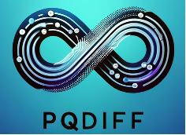
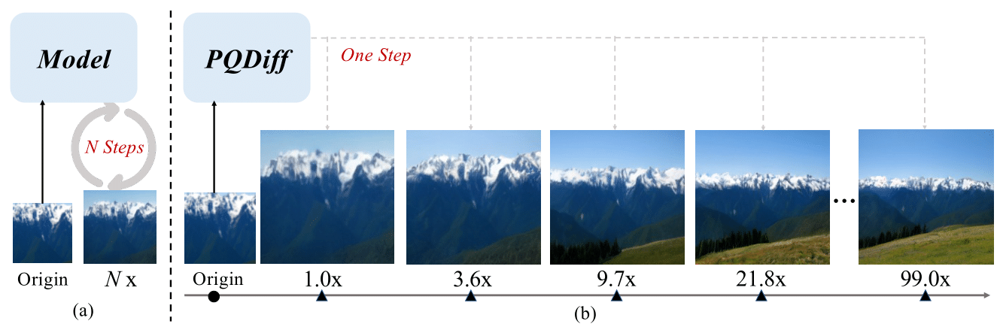
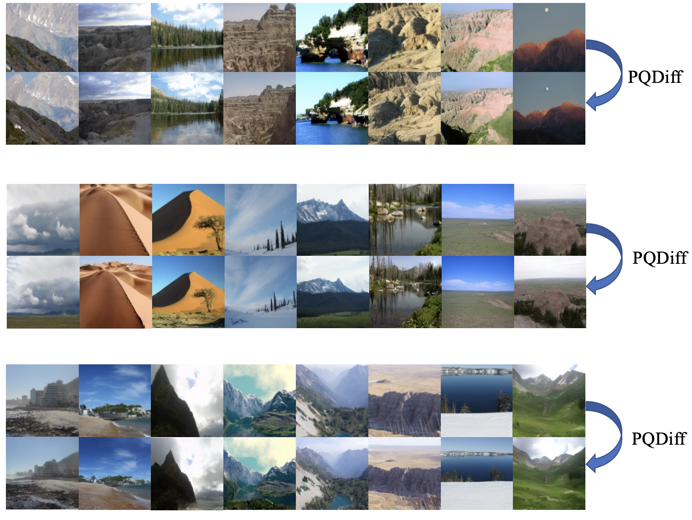
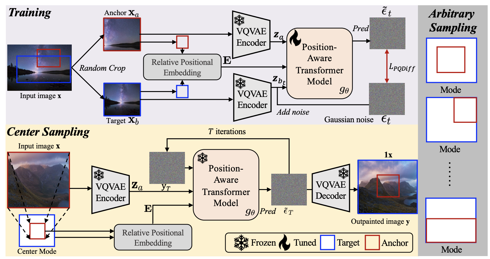

# PQDiff — Single-GPU Training & Optimization (Fork)

This is a fork of [PQDiff](https://github.com/Sherrylone/PQDiff) (ICLR 2024), re-engineered to train on a
single 8GB consumer GPU instead of the original 8×GPU cluster. The model architecture is unchanged; the
training pipeline, memory footprint, and convergence behavior were diagnosed and optimized for this
constraint as part of a research-internship reproduction project.

## What's different in this fork

- **Gradient accumulation** ([`train_ldm.py`](train_ldm.py)): true effective-batch training via
  `accelerate.Accelerator(gradient_accumulation_steps=...)`, processing small micro-batches while
  accumulating gradients to match a much larger target batch size — without the memory cost of a literal
  large batch.
- **Cosine warmup + decay LR scheduler** ([`utils.py`](utils.py)): added `cosine_warmup_lr_scheduler` to fix
  a loss plateau identified by analyzing 432,000+ steps of real training logs — the original `customized`
  scheduler holds the learning rate constant forever after warmup, which turned out to be the dominant
  cause of the plateau (see `improvement.md` §1.4).
- **8-bit AdamW + optional EMA disable**: a `bitsandbytes`-backed 8-bit optimizer plus a `use_ema` config
  flag, together cutting the model's fixed GPU memory floor enough to train alongside other workloads on a
  shared GPU.
- **`configs/flickr192_optimized.py`**: a new config combining all of the above, sized for a single
  RTX 2070 (8GB), in between the original repo's `flickr192_local.py` (batch=4, too noisy to converge
  cleanly) and `flickr192_large.py` (batch=256, computationally infeasible on one consumer GPU).
- **[`improvement.md`](improvement.md)**: full convergence diagnosis (root causes, quantitative evidence),
  the GPU memory-optimization investigation, and a benchmarking methodology against the paper's reported
  metrics.
- **[`details.md`](details.md)**: architecture deep-dive and a step-by-step setup/training guide specific
  to this hardware.

## Quick start (this fork)

```bash
pip install -r requirements.txt
# Download the autoencoder and place the dataset — see details.md §7 for exact paths and the
# original download links below.
./train_resume.sh
```

---

## About the original project: PQDiff

<div align=center>

</div>
<h3 align="center"><a href="https://arxiv.org/abs/2401.15652">[ICLR 2024] Continuous-Multiple Image Outpainting in One-Step via Positional Query and A Diffusion-based Approach</a></h3>

<h5 align="center">

   [](https://arxiv.org/pdf/2401.15652.pdf)

</h5>

<h4 align="center">
Shaofeng Zhang<sup>1</sup>, Jinfa Huang<sup>2</sup>, Qiang Zhou<sup>3</sup>, Zhibin Wang<sup>3</sup>, Fan Wang<sup>4</sup>, Jiebo Luo<sup>2</sup>, Junchi Yan<sup>1,*</sup>

<sup>1</sup>Shanghai Jiao Tong University, <sup>2</sup>University of Rochester,  <sup>3</sup>INF Tech Co., Ltd., <sup>4</sup>Alibaba Group
</h4>

PQDiff outpaints images with arbitrary and continuous multiples in one step by learning positional
relationships and pixel information jointly. See the [original repository](https://github.com/Sherrylone/PQDiff)
for the canonical implementation, model zoo, and full multi-GPU training instructions.



### Model Zoo (from the original repository)

|Checkpoint|Google Cloud|Baidu Yun|
|:--------:|:-----------:|:-----------:|
| Scenery | [Download](https://drive.google.com/drive/folders/1tfoDWm-qt63nCRMVDDkvQwcji9lgU0iq?usp=sharing) | TBD |
| Building Facades | TBD | TBD |
| WikiArt | TBD | TBD |

### Dataset preparing

Flickr, Buildings, and WikiArt datasets, obtained at [QueryOTR](https://github.com/Kaiseem/QueryOTR).

### Download the autoencoder

The autoencoder (transformed from Stable Diffusion) is available [here](https://drive.google.com/file/d/130Cq8uFKEqK8sgroIwN7hnRdNvB9DkCo/view?usp=sharing).

### Original multi-GPU training command (8×GPU cluster)

```
accelerate launch --multi_gpu --num_processes 8 --mixed_precision fp16 train_ldm.py --config=configs/flickr192_large.py
```

### Sampling stage

The original repo provides 2.25x, 5x, and 11.7x outpainting settings (with copy operation):

```
python3 -m torch.distributed.launch --nproc_per_node=8 \
        --node_rank 0 \
        --master_addr=${MASTER_ADDR:-127.0.0.1} \
        --master_port=${MASTER_PORT:-46123} \
        evaluate.py --target_expansion 0.25 0.25 0.25 0.25 --eval_dir ./eval_dir/scenery/1x/ --size 128 \
                --config flickr192_large
```

Outpaint at arbitrary and continuous multiples by changing the `target_expansion` parameters
(top, down, left, right).

### Evaluation stage

```
python eval_dir/inception.py --path ./path1/
python -m pytorch_fid ./path1/ ./path2/
python eval_dir/psnr.py --original ./ori_dir/ --contrast ./gen_dir/
```

Generated samples from the original project:



### Framework



- For training, the image is randomly cropped twice at different ratios to obtain two views, then the
  relative positional embeddings of the anchor view (red box) and the target view (blue box) are computed.
- For sampling, the target view (blue box) is computed from the anchor view (red box) to form a positional
  relation. Varying this mode enables arbitrary and controllable image outpainting.

### Acknowledgement

* [QueryOTR](https://github.com/Kaiseem/QueryOTR) — image outpainting datasets and a strong baseline.
* [PQCL](https://github.com/Sherrylone/PQCL) — inspired the positional query scheme used in this work.

### Citation

If this is helpful to your work, please cite the original paper:

```bibtex
@misc{zhang2024continuousmultiple,
      title={Continuous-Multiple Image Outpainting in One-Step via Positional Query and A Diffusion-based Approach}, 
      author={Shaofeng Zhang and Jinfa Huang and Qiang Zhou and Zhibin Wang and Fan Wang and Jiebo Luo and Junchi Yan},
      year={2024},
      eprint={2401.15652},
      archivePrefix={arXiv},
      primaryClass={cs.CV}
}
```
